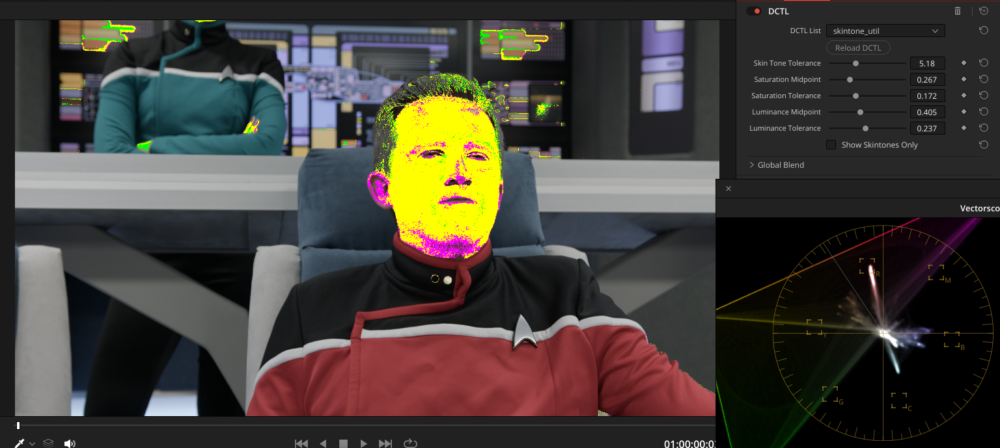
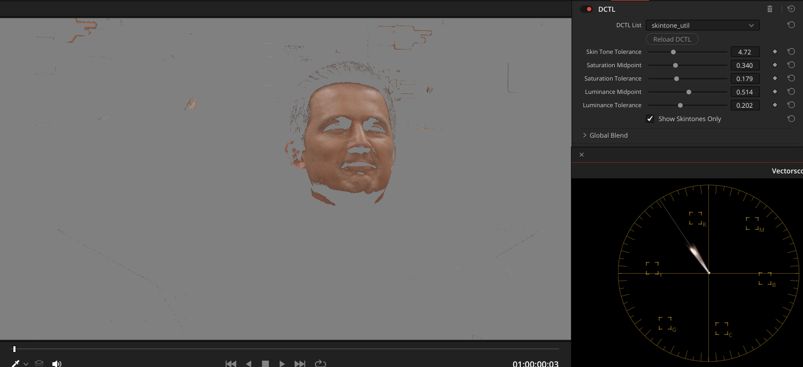

# DCTL Utils

## Skin Tone Util

> inspired by "Skin Tone Indicator" from MONONODES (https://mononodes.com/utility-dctl/)

- highlights skin tone
- use sliders to modify tolerances

### How does it work?

Picks a hue of 18°, which should be a skin tone line. And anything that is inside
saturation and luminance boundaries and Hue +/- tolerance is marked as yellow,
anything below is green and above is magenta.

## Installation

Copy `.dctl` files to your LUT folder set up in DaVinci Resolve
